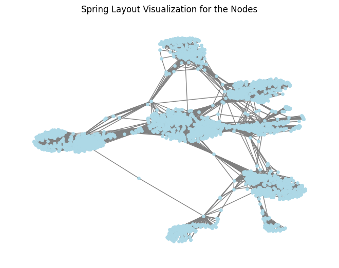
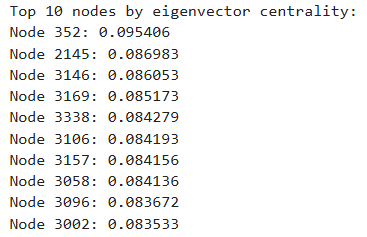
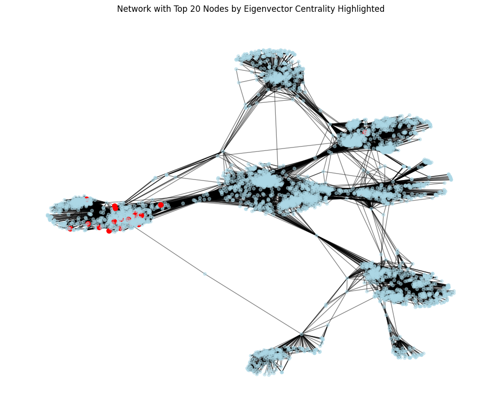
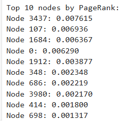
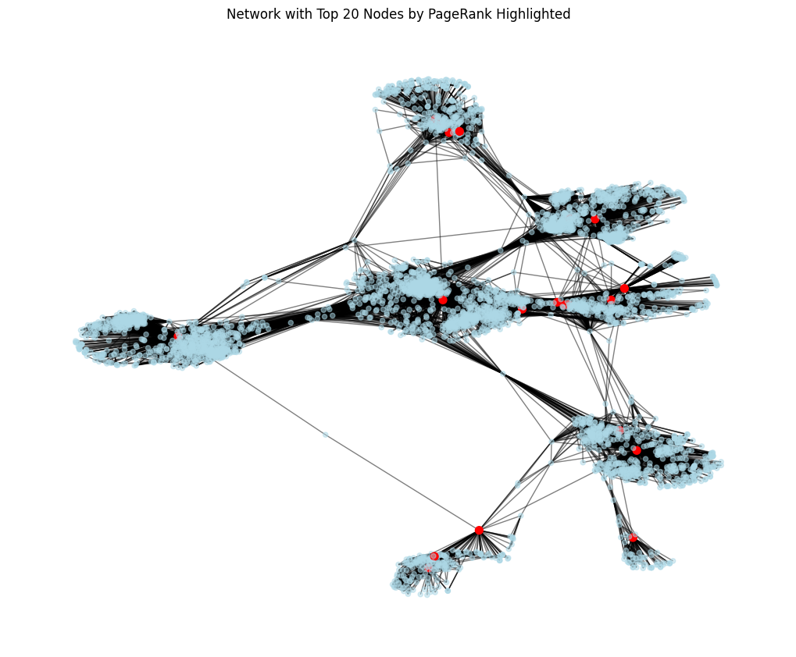
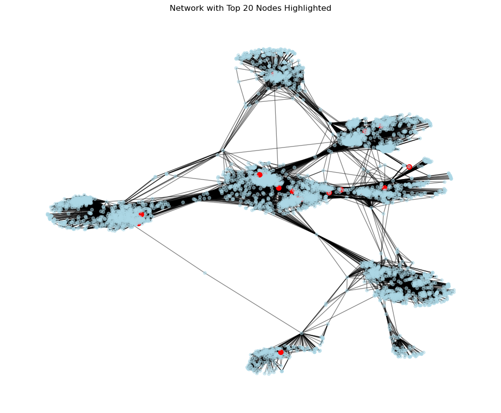
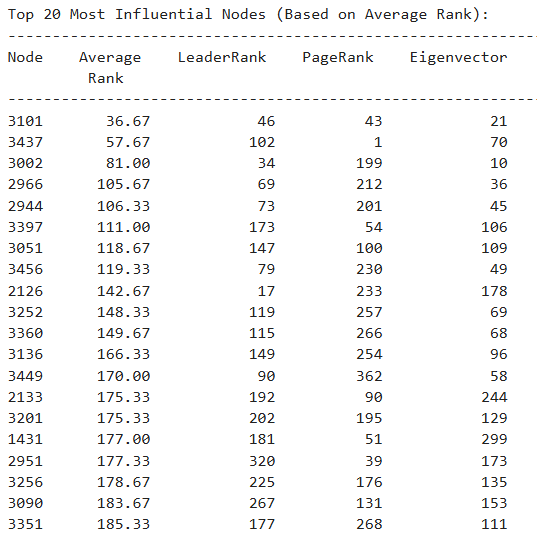
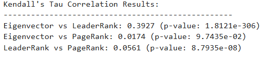

# DSC210_project
Below are codes and experiment results for DSC210 Project (24 Fall)

## Introduction

This project implements three different approaches (Eigenvector centrality, PageRank and LeaderRank) to analyze social networks and identify the most influential nodes.


## Features

1. **Adjacency Matrix Construction**:
   - Converts the input edge list into an adjacency matrix for analysis.

2. **Algorithm implementation**:
   - Identifies the most important nodes in the network using Eigenvector centrality, PageRank, and LeaderRank.

3. **Top Nodes Visualization**:
   - Highlights the top 20 influential nodes in the network graph using color coding (red for top nodes).

4. **Result Analysis**


## File Structure

- **`Node_Importance_in_Graph.ipynb`**: The main notebook that implements the experiments and shows the visualizations.
- **`SNAP_facebook`**: Dataset used to perform the experiments.


## Installation

### Prerequisites

Ensure you have installed:
- Python 3.10.12
- Jupyter notebook

### Steps
1. Clone [this project](https://github.com/Clement1290/DSC210_project.git) in the root file
2. install the environments
```bash
pip install -r requirements.txt
```
3. Open **`Node_Importance_in_Graph.ipynb`** and run all the cells of the notebook.
- Note that it may take a few minutes to show the visualization
  
## Experiment Results

### Eigenvector centrality & PageRank




### LeaderRank


### Remarks


